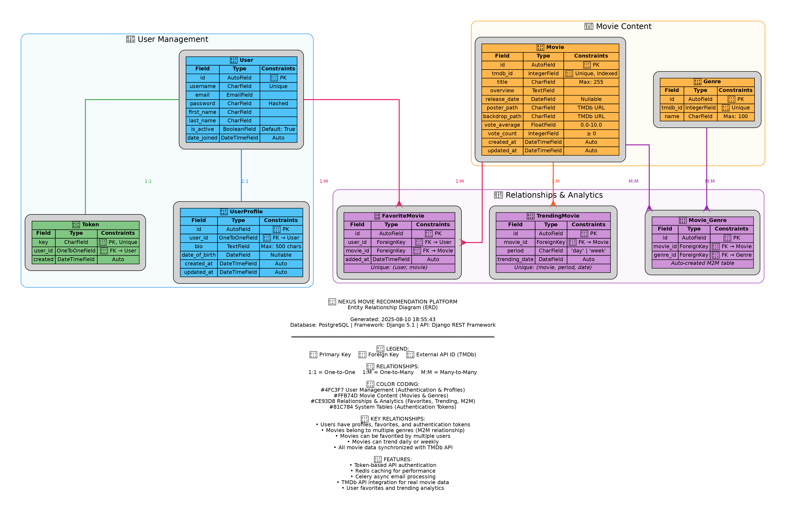

# Nexus - Movie Recommendation Platform (Backend)

[](https://railway.app/template/nexus)

A production-ready Django REST API for movie recommendations, featuring real-time data from The Movie Database (TMDb), Redis caching, asynchronous email processing, and comprehensive user management. This almost made me lose my mind - just saying.

## Live Demo

**API Base URL**: https://nexus-kingsley.up.railway.app

- **API Documentation**: https://nexus-kingsley.up.railway.app/api/docs/
- **Admin Panel**: https://nexus-kingsley.up.railway.app/admin/
- **API Root**: https://nexus-kingsley.up.railway.app/api/

## Features

### Movie Features
- **Multiple Movie Categories**: Popular, Top Rated, Upcoming, Now Playing
- **Trending Movies**: Daily and weekly trending content
- **Genre Management**: Organized movie categorization
- **Search & Filtering**: Advanced movie discovery
- **TMDb Integration**: Real-time movie data and posters (40 pages per endpoint)
- **Caching**: Redis-powered performance optimization
- **Large Dataset**: Automatically populates ~4,800 movies from multiple TMDb endpoints

### User Features  
- **Authentication**: Token-based API authentication
- **User Profiles**: Customizable user information
- **Favorites System**: Save and manage favorite movies
- **Email Notifications**: Async welcome emails via Celery
- **Admin Interface**: Full Django admin panel

### Technical Features
- **REST API**: Comprehensive RESTful endpoints
- **Database**: PostgreSQL with optimized queries
- **Caching**: Redis for high-performance responses
- **Async Tasks**: Celery with Redis broker
- **Documentation**: Auto-generated Swagger/OpenAPI docs
- **Production Ready**: Deployed on Railway with health checks

## Database Schema

The Nexus platform uses a carefully designed relational database schema to manage users, movies, and their relationships efficiently.



### Core Models

**User Management**
- **User**: Django's built-in user model with authentication
- **UserProfile**: Extended user information (bio, date of birth, timestamps)
- **Token**: API authentication tokens for secure access

**Movie Content**
- **Movie**: Core movie data synchronized with TMDb API
- **Genre**: Movie categorization system
- **Movie_Genre**: Many-to-many relationship between movies and genres

**Relationships & Analytics**
- **FavoriteMovie**: User-movie favorites tracking
- **TrendingMovie**: Daily and weekly trending movie analytics

### Key Relationships
- **User to UserProfile**: One-to-one relationship for extended profile data
- **User to Token**: One-to-one relationship for API authentication
- **User to FavoriteMovie**: One-to-many for user's favorite movies
- **Movie to FavoriteMovie**: One-to-many for movies favorited by users
- **Movie to TrendingMovie**: One-to-many for trending periods
- **Movie to Genre**: Many-to-many through Movie_Genre junction table

## Tech Stack

- **Backend**: Django 5.1 + Django REST Framework
- **Database**: PostgreSQL (Railway managed)
- **Cache**: Redis (Railway managed)
- **Task Queue**: Celery + Redis
- **Email**: SMTP (Zoho/Gmail compatible)
- **Documentation**: drf-yasg (Swagger/OpenAPI)
- **Deployment**: Railway with Nixpacks
- **External API**: The Movie Database (TMDb)

## Quick Start

### Prerequisites
- Python 3.11+
- TMDb API Key ([Get one here](https://www.themoviedb.org/settings/api))
- Redis (for caching and Celery)
- PostgreSQL (optional for local dev)

### Local Development

1. **Clone the repository**
```bash
git clone https://github.com/TheKingsident/nexus.git
cd nexus
```

2. **Create virtual environment**
```bash
python -m venv venv
source venv/bin/activate  # On Windows: venv\Scripts\activate
```

3. **Install dependencies**
```bash
pip install -r requirements.txt
```

4. **Environment Configuration**
```bash
cp .env.example .env
# Edit .env with your configuration
```

Required environment variables:
```env
# TMDb API
TMDB_API_KEY=your_tmdb_api_key

# Database (SQLite for local dev)
DATABASE_URL=sqlite:///db.sqlite3

# Redis
REDIS_URL=redis://localhost:6379/0

# Email Configuration
EMAIL_HOST=smtp.zoho.com
EMAIL_PORT=587
EMAIL_HOST_USER=your-email@example.com
EMAIL_HOST_PASSWORD=your-password
EMAIL_USE_TLS=True
DEFAULT_FROM_EMAIL=noreply@example.com

# Security
SECRET_KEY=your-secret-key
DEBUG=True
```

5. **Database Setup**
```bash
python manage.py migrate
python manage.py createsuperuser
```

6. **Populate Database**
```bash
python manage.py fetch_tmdb_movies --pages=40
```

7. **Start Services**

Terminal 1 - Django:
```bash
python manage.py runserver
```

Terminal 2 - Celery Worker:
```bash
celery -A nexus worker --loglevel=info
```

Terminal 3 - Redis (if not system service):
```bash
redis-server
```

## API Endpoints

### Movies
```
GET  /api/movies/                    # All movies
GET  /api/movies/{id}/               # Movie detail
GET  /api/movies/popular/            # Popular movies  
GET  /api/movies/top-rated/          # Top rated movies
GET  /api/movies/upcoming/           # Upcoming movies
GET  /api/movies/now-playing/        # Now playing movies
GET  /api/movies/trending/day/       # Daily trending
GET  /api/movies/trending/week/      # Weekly trending
GET  /api/movies/search/?q=query     # Search movies
GET  /api/movies/genres/             # All genres
```

### Users
```
POST /api/users/register/            # User registration
POST /api/users/login/               # User login
POST /api/users/logout/              # User logout
GET  /api/users/me/                  # Current user info
GET  /api/users/profile/             # User profile
PUT  /api/users/profile/             # Update profile
```

### Favorites
```
GET  /api/movies/favorites/                    # User's favorites
POST /api/movies/favorites/add/{movie_id}/     # Add to favorites
POST /api/movies/favorites/remove/{movie_id}/  # Remove from favorites
```

### Admin & Health
```
GET  /api/users/admin-status/        # Check superuser status
POST /api/users/create-admin/        # Create admin user
GET  /health/                        # Health check
GET  /api/                          # API root
```

## Deployment

### Railway Deployment (Recommended)

1. **Fork this repository**

2. **Connect to Railway**
   - Visit [Railway](https://railway.app)
   - Create new project from GitHub repo
   - Select your forked nexus repository

3. **Add Environment Variables**
   ```
   TMDB_API_KEY=your_tmdb_api_key
   EMAIL_HOST=smtp.zoho.com
   EMAIL_PORT=587
   EMAIL_HOST_USER=your-email@example.com
   EMAIL_HOST_PASSWORD=your-password
   EMAIL_USE_TLS=True
   DEFAULT_FROM_EMAIL=noreply@example.com
   ```

4. **Add Services**
   - **PostgreSQL**: Add from Railway marketplace
   - **Redis**: Add from Railway marketplace
   - Copy connection URLs to your environment

5. **Deploy**
   - Railway auto-deploys on git push
   - Database migrations run automatically
   - Superuser created automatically if env vars set
   - Movie database populated automatically (40 pages from TMDb)

### Manual Deployment

For other platforms, ensure:
- Python 3.11+ runtime
- PostgreSQL database
- Redis instance  
- Environment variables configured
- Run: `./start.sh` or individual commands from Procfile

## Project Structure

```
nexus/
├── nexus/                    # Django project settings
│   ├── settings.py              # Django configuration
│   ├── urls.py                  # Main URL routing
│   ├── wsgi.py                  # WSGI application
│   └── celery.py                # Celery configuration
├── movies/                   # Movies app
│   ├── models.py                # Movie, Genre, FavoriteMovie models
│   ├── views.py                 # Movie API views with caching
│   ├── serializers.py           # DRF serializers
│   ├── urls.py                  # Movie endpoints
│   └── management/commands/
│       └── fetch_tmdb_movies.py # TMDb data population
├── users/                    # Users app  
│   ├── models.py                # UserProfile model
│   ├── views.py                 # Authentication & profile views
│   ├── serializers.py           # User serializers
│   ├── urls.py                  # User endpoints
│   ├── tasks.py                 # Celery email tasks
│   └── management/commands/
│       └── create_admin.py      # Superuser creation
├── staticfiles/              # Static files (auto-generated)
├── Procfile                  # Process definitions
├── start.sh                  # Startup script with auto-setup
├── railway.toml              # Railway configuration  
├── requirements.txt          # Python dependencies
└── README.md                 # This file
```

## Configuration

### Caching Strategy
- **Popular movies**: 15 minutes
- **Top rated movies**: 1 hour  
- **Trending movies**: 5 minutes
- **Movie details**: 30 minutes
- **Search results**: 10 minutes

### Email Configuration
- **Welcome emails**: Sent asynchronously via Celery
- **Retry logic**: 3 attempts with exponential backoff
- **Fallback**: Synchronous sending if Celery unavailable

### Database Optimization
- **Connection pooling**: Optimized for Railway PostgreSQL
- **Query optimization**: Select related for foreign keys
- **Indexing**: Optimized for common queries
- **Auto-population**: Fetches 40 pages (~800 movies per endpoint) from TMDb
- **Smart fetching**: Only fetches new movies if database has fewer than 500 movies

## Testing

### API Testing
```bash
# Test popular movies endpoint
curl https://nexus-kingsley.up.railway.app/api/movies/popular/

# Test user registration
curl -X POST https://nexus-kingsley.up.railway.app/api/users/register/ \
  -H "Content-Type: application/json" \
  -d '{"username":"testuser","email":"test@example.com","password":"testpass123"}'

# Test admin status
curl https://nexus-kingsley.up.railway.app/api/users/admin-status/

# Manually fetch more movies (40 pages)
python manage.py fetch_tmdb_movies --pages=40
```

### Health Checks
```bash
# Basic health check
curl https://nexus-kingsley.up.railway.app/health/

# Database and cache status
curl https://nexus-kingsley.up.railway.app/api/
```

## Troubleshooting

### Common Issues

**1. TMDb API Errors**
```bash
# Verify API key
curl "https://api.themoviedb.org/3/movie/popular?api_key=YOUR_API_KEY"

# Check if fetch command is working
python manage.py fetch_tmdb_movies --pages=5  # Test with fewer pages first
```

**2. Email Not Sending**
- Check SMTP credentials in environment variables
- Verify Celery worker is running
- Check Railway logs for email errors

**3. Caching Issues**
```bash
# Test Redis connection
redis-cli -u $REDIS_URL ping
```

**4. Database Connection**
- Verify DATABASE_URL in environment
- Check Railway PostgreSQL service status

### Logs
```bash
# Railway logs
railway logs

# Local development
python manage.py runserver --verbosity=2
```

## Contributing

1. **Fork the repository**
2. **Create feature branch**: `git checkout -b feature/amazing-feature`
3. **Commit changes**: `git commit -m 'Add amazing feature'`
4. **Push to branch**: `git push origin feature/amazing-feature`  
5. **Open Pull Request**

### Development Guidelines
- Follow PEP 8 style guide
- Add tests for new features
- Update documentation
- Ensure all tests pass

## License

This project is licensed under the MIT License - see the [LICENSE](LICENSE) file for details.

## Support

- **Email**: hello@kingsleyusa.dev
- **Issues**: [GitHub Issues](https://github.com/TheKingsident/nexus/issues)
- **Documentation**: [API Docs](https://nexus-kingsley.up.railway.app/api/docs/)

## Acknowledgments

- **The Movie Database (TMDb)** for providing movie data
- **Railway** for hosting infrastructure
- **Django REST Framework** for the excellent API framework
- **Redis** for caching and task queue capabilities

---